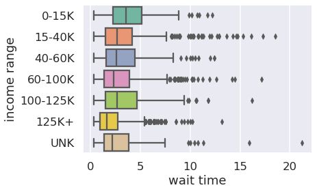
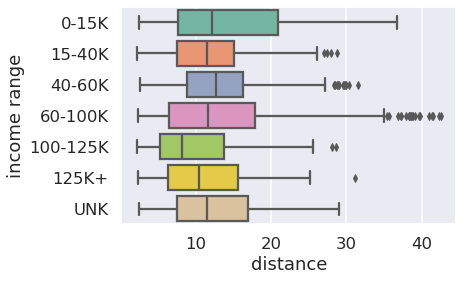
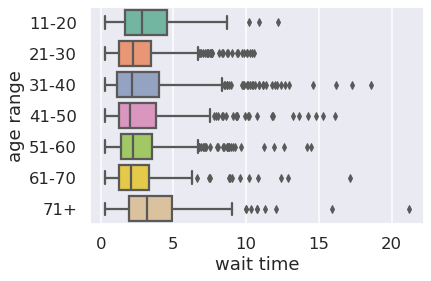
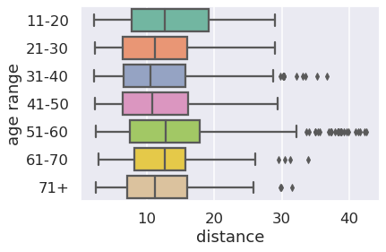
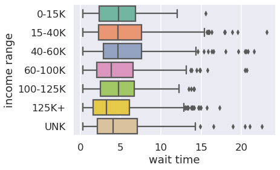
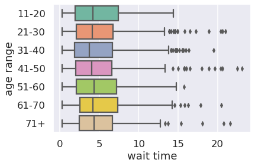

# amod-toronto
Autonomous Mobility-on-Demand (AMoD) simulation and analysis pipeline for
Toronto.

## Overview
Driverless, autonomous vehicles (AVs) pose sweeping implications for the future
of our cities and roads, from congestion to the design and usage of public
spaces. In Ontario, the Ministry of Transportation has allowed AVs to be tested
on public roads under certain conditions. Though it may be years still before
fully autonomous vehicles roam our streets, we are at a critical window of
opportunity to anticipate and plan for their impacts on our cities and citizens.
In this project, I test different operating scenarios of autonomous,
mobility-on-demand (AMoD) vehicle fleets in the City of Toronto. This pipeline
includes generating a synthetic trips dataset and using the AMoDeus library to
create, run, and view agent-based models of AV fleets. After running the simulation, I explore how metrics such as passenger wait
times and fleet travel distances vary across different operating policies and
income and age groups.

## Installation
To use data_utils:
```
cd data_utils
pip install -r requirements.txt
```
You will need `GDAL` for the postprocessing notebook. Install by going to
https://pypi.org/project/GDAL/ or running `conda install GDAL`. To configure AMoDeus, follow the `README.md` in
[amod](https://github.com/philipqlu/amod-toronto/amod) and 
[amodtaxi](https://github.com/philipqlu/amod-toronto/amodtaxi).

## amod
Contains code to run the scenario creation and simulation pipeline. Uses 
**amodtaxi** to create the initial scenario.

### How to run in Eclipse
* Create a folder to store the simulation results.
* Set up run configurations, setting the working directory to the created folder
above. See [amod](https://github.com/philipqlu/amod-toronto/tree/main/amod) for
more instructions.

## amodtaxi
Contains code and configuration for creating the MATSim/AMoDeus scenario for
Toronto.

To create your own scenario, at minimum you require:
* population (eg. taxi trips dataset)
* location specs consisting of the bounding box, EPSG code, and reference frame
center for the area of interest

The scenario settings are stored in the `src/main/resources/` folder. The
rest is a data pipeline that runs these steps: loading the map and trip dataset, 
building a MATSim network, and creating a population.

## data_utils
Contains the preprocessing code for synthesizing a population/trip dataset and
postprocessing code for cleaning and plotting the results. The `input` folder
contains the trip synthesis code and all required datasets. The `output`
folder contains the AMoDeus simulation results, analysis notebook, and plots.

## Dispatching Algorithms Used
* **Global Euclidean Bipartite Matching**: Ruch, C., Hörl, S. and Frazzoli, E.,
  2015. Amodeus, a simulation-based testbed for autonomous
  mobility-on-demand systems. In *2018 21st International Conference on
  Intelligent Transportation Systems (ITSC)* (pp. 3639-3644). IEEE.
* **Demand-Supply Balancing**: Maciejewski, M. and Bischoff, J., 
  2018. Large-scale microscopic simulation of taxi services. *Procedia Computer
  Science*, 52, pp.358-364.
* **Model-Free Adaptive Repositioning**: Ruch, C., Gachter, J., Hakenberg, J.
  and Frazzoli, E., 2020. The+ 1 Method: Model-Free Adaptive Repositioning
  Policies for Robotic Multi-Agent Systems. *IEEE Transactions on Network
  Science and Engineering.*

## Demo
### Global Euclidean Bipartite Matching


### Demand-Supply Balancing


### Model-Free Adaptive Repositioning


## Sample results
Baseline results show that the choice of AV fleet policy does influence how
wait times are distributed across income groups. In particular, passengers from
lower income households tend to experience longer wait times when a fleet
rebalancing algorithm is used. Non-rebalancing policies don't show this
tendency, suggesting that the rebalancing policy could potentially exacerbate
mobility inequities between passengers in low and high income households. There
doesn't appear to be a trend in wait times or travel distances with respect to passenger age groups.

### Model-Free Adaptive Repositioning
The below results are with a fleet size of 200.

Wait times across household income | Distances across household income
:-------------------------:|:-------------------------:
 | 

Wait times across age groups | Distances across age groups
:-------------------------:|:-------------------------:
 | 

### Demand-Supply Balancing 
The below results are with a fleet size of 200.

Wait times across household income | Distances across household income
:-------------------------:|:-------------------------:
 | 

Wait times across age groups | Distances across age groups
:-------------------------:|:-------------------------:
 | 